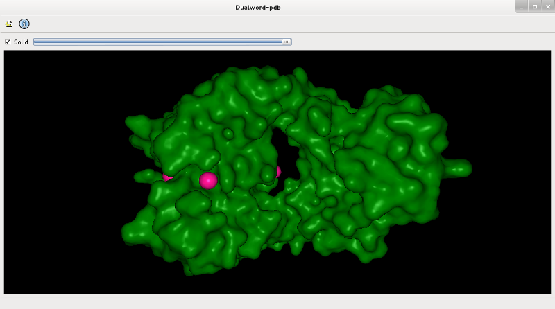
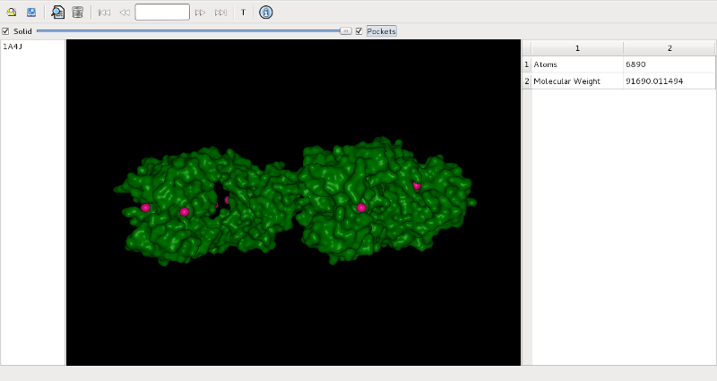

Dualword-pdb - PDB viewer.

Features:
 - PDB viewer
 - downloading from Protein Data Bank
 - identification of protein pockets
 
License: GNU General Public License (Version 3)  
Source code: http://github.com/dualword/dualword-pdb/  

Third Party Software:
 - Qt License: LGPL
 - ChemKit License: BSD
 - BALL License: GNU LGPL
 - LIGSITEcsc License: GNU GPL
 

